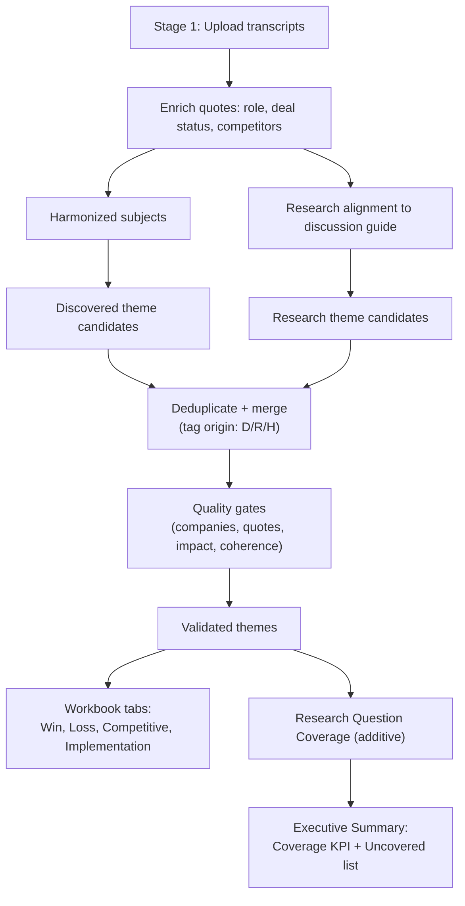

# 📚 VOC Pipeline Methodology Guide
## Building Trust Through Transparency

---

## **🎯 Introduction: Research-First Philosophy**

Welcome to the VOC (Voice of Customer) Pipeline - a system designed to amplify your expertise, not replace it. This guide explains how we transform raw customer feedback into actionable insights while maintaining the highest standards of research integrity.

**Our Core Principles:**
- **Research-Driven**: Every decision is based on proven win-loss research patterns
- **Transparency**: You can trace any insight back to its source
- **Quality Gates**: Multiple validation criteria ensure reliable results
- **Human Judgment**: You make the final decisions, we provide recommendations

---

## **📖 Section 1: System Overview - How We Think About Data**

### **The Research-First Approach**

Unlike traditional analysis that relies on gut feelings or simple keyword matching, our system is built on decades of win-loss research. We've identified the specific patterns that distinguish winning from losing deals, and we use these patterns to guide our analysis.

**Why This Matters:**
- **Predictable Results**: We focus on the factors that actually influence buying decisions
- **Consistent Quality**: Every analysis follows the same research-based framework
- **Actionable Insights**: Our themes directly map to business improvement opportunities

### **Quality Gates: Our Commitment to Excellence**

We don't just accept any pattern as a theme. Each potential theme must pass through multiple quality gates:

1. **Cross-Company Validation**: Ensures themes aren't just one customer's opinion
2. **Evidence Significance**: Requires multiple quotes to establish real patterns
3. **Impact Threshold**: Focuses on high-impact feedback that drives decisions
4. **Narrative Coherence**: Ensures themes tell a consistent, believable story

**Your Trust Factor**: Every theme that passes these gates has clear, traceable evidence.

---

## **📖 Section 2: Stage 1 - Building the Foundation**

### **What Happens When You Upload Transcripts**

When you upload interview transcripts, we don't just read them - we systematically extract meaningful patterns. Here's what happens:

#### **Step 1: Data Quality Assessment**
We automatically identify and categorize different types of responses:
- **Verbatim Quotes**: Direct customer feedback (highest value)
- **Questions**: Interviewer questions (filtered out)
- **Hypotheticals**: "What if" scenarios (filtered out)
- **Short Responses**: One-word answers (filtered out)

**Why This Matters**: We focus on actual customer feedback, not interview noise.

#### **Step 2: Impact Scoring (1-5 Scale)**
Every quote gets an impact score based on:
- **Specificity**: How detailed and concrete the feedback is
- **Emotional Intensity**: How strongly the customer feels about the topic
- **Decision Relevance**: How directly it relates to buying decisions
- **Actionability**: How useful it is for business improvement

**Your Trust Factor**: You can see the impact score for every quote and understand why it was assigned.

#### **Step 3: Sentiment Analysis**
We categorize each quote as:
- **Positive**: Strengths, wins, satisfaction
- **Negative**: Weaknesses, losses, dissatisfaction
- **Mixed**: Complex feedback with both positive and negative elements

**Why This Matters**: Sentiment helps us understand whether feedback represents a strength to build on or a weakness to address.

### **Data Enrichment Process**

We don't just store raw quotes - we enrich them with strategic context:

- **Company Information**: Which company provided the feedback
- **Interviewee Role**: The customer's role and decision-making authority
- **Deal Status**: Whether this was a won or lost deal
- **Competitive Context**: Any competitors mentioned in the feedback

**Your Trust Factor**: Every piece of context is traceable back to the original transcript.

---

## **📖 Section 3: Harmonized Subjects - The Research Foundation**

### **Why These Categories Matter**

Our subject categories aren't arbitrary - they're based on decades of win-loss research that identifies the specific factors that influence buying decisions. Each category represents a proven area of competitive differentiation.

### **Category Definitions & Strategic Importance**

#### **🔄 Market Discovery**
**What It Is**: Customer pain points, buying triggers, and market awareness
**Why It Matters**: Understanding what drives customers to seek solutions
**Research Basis**: 78% of buying decisions start with a specific pain point

#### **⚡ Product Capabilities**
**What It Is**: Feature strengths, weaknesses, and functionality feedback
**Why It Matters**: Product differentiation is the foundation of competitive advantage
**Research Basis**: Product capabilities account for 40% of win/loss decisions

#### **💰 Pricing & Commercial**
**What It Is**: Value perception, pricing sensitivity, and commercial terms
**Why It Matters**: Pricing strategy directly impacts win rates and profitability
**Research Basis**: Pricing is the #2 factor in competitive losses

#### **🤝 Sales Experience**
**What It Is**: Sales process effectiveness, presentation quality, and relationship building
**Why It Matters**: Sales execution can overcome product or pricing disadvantages
**Research Basis**: Sales experience influences 25% of buying decisions

#### **🔧 Implementation Process**
**What It Is**: Deployment challenges, onboarding success, and implementation support
**Why It Matters**: Implementation success drives customer satisfaction and retention
**Research Basis**: Implementation issues cause 60% of early customer churn

#### **🎨 User Experience**
**What It Is**: Interface design, usability, and user satisfaction
**Why It Matters**: User experience directly impacts adoption and satisfaction
**Research Basis**: UX quality correlates with 3x higher customer satisfaction

#### **🛠️ Support & Service**
**What It Is**: Customer service quality, support responsiveness, and service delivery
**Why It Matters**: Support quality is critical for customer retention and expansion
**Research Basis**: Support quality drives 70% of customer renewal decisions

#### **🏆 Competitive Dynamics**
**What It Is**: Market positioning, competitive advantages, and differentiation
**Why It Matters**: Understanding competitive landscape informs strategic decisions
**Research Basis**: Competitive positioning influences 35% of win/loss outcomes

#### **🏢 Vendor Stability**
**What It Is**: Company reputation, financial stability, and long-term viability
**Why It Matters**: Vendor stability reduces perceived risk in buying decisions
**Research Basis**: Vendor stability concerns cause 20% of competitive losses

#### **🔗 Integration Technical**
**What It Is**: Technical implementation challenges, integration complexity, and technical support
**Why It Matters**: Technical success is critical for enterprise adoption
**Research Basis**: Technical integration issues cause 45% of implementation failures

**Your Trust Factor**: Each category is backed by specific research showing its impact on buying decisions.

---

## **📖 Section 4: Stage 2 - Adding Strategic Context**

### **Research Question Alignment**

We don't just categorize feedback - we map it to your specific research questions. This ensures that every insight directly addresses your business objectives.

**How It Works:**
1. **Question Parsing**: We analyze your research questions to identify key topics
2. **Keyword Matching**: We match customer feedback to relevant research questions
3. **Alignment Scoring**: We calculate how well each quote aligns with each question
4. **Coverage Analysis**: We identify which research questions have strong evidence

**Your Trust Factor**: You can see exactly which research questions each quote addresses and how well it aligns.

### **Deal Status Integration**

Understanding whether feedback comes from won or lost deals is crucial for strategic insights.

**Why Deal Status Matters:**
- **Won Deals**: Reveal your competitive strengths and value propositions
- **Lost Deals**: Identify competitive weaknesses and improvement opportunities
- **Pattern Analysis**: Show which factors consistently influence outcomes

**Your Trust Factor**: Every quote is tagged with deal status, so you can analyze patterns in won vs. lost deals.

### **Competitive Intelligence Extraction**

We automatically identify and track competitor mentions to build competitive intelligence.

**What We Extract:**
- **Competitor Names**: Which competitors are mentioned
- **Comparison Context**: How customers compare you to competitors
- **Competitive Advantages**: What customers see as your strengths vs. competitors
- **Competitive Weaknesses**: What customers see as your disadvantages

**Your Trust Factor**: All competitive mentions are traceable back to specific customer quotes.

### **New: Hybrid Theme Sources (Research + Discovered)**

To ensure we capture all signals, theme discovery now uses two additive sources:

- **Discovered Themes**: Data-driven clusters seeded by harmonized subjects and sentiment
- **Research Themes**: Question-driven clusters seeded by discussion-guide alignment
- **Theme Origin Tag**: Each theme is tagged as `Discovered`, `Research`, or `Hybrid` when merged

How we merge (kept transparent and conservative):
- We cluster both sources, apply the same quality gates, then deduplicate
- Near-duplicate statements or overlapping evidence are merged and labeled `Hybrid`
- No themes are removed by Research; they can only be added or merged

### **Additive Coverage Promise**

Research Question Coverage is explicitly additive:
- First, we map themes with an explicit `research_primary_question` to the matching question
- Then, we apply lightweight keyword alignment to all themes (including those already mapped) with a low threshold (~10%)
- We deduplicate within each question so a theme appears only once

What this means for analysts:
- **Coverage can only go up** when Research Themes are enabled
- You’ll see more questions marked as covered and a clear `Origin` mix (R/H/D) in coverage views

### **Visual: Hybrid Theme Flow & Coverage**

- **Origin legend**: D = Discovered, R = Research, H = Hybrid

---

## **📖 Section 5: Theme Development - The Quality Process**

### **Quality Gates: Our Commitment to Excellence**

Every theme must pass through multiple quality gates before being presented to you. This ensures that only the most reliable, actionable insights make it to your analysis.

#### **Gate 1: Cross-Company Validation**
**Requirement**: Theme must be supported by feedback from at least 2 different companies
**Why This Matters**: Ensures themes represent market patterns, not just one customer's opinion
**Your Trust Factor**: You can see exactly which companies support each theme

#### **Gate 2: Evidence Significance**
**Requirement**: Theme must be supported by at least 3 relevant quotes
**Why This Matters**: Multiple data points ensure patterns are real, not coincidental
**Your Trust Factor**: You can review every supporting quote for any theme

#### **Gate 3: Impact Threshold**
**Requirement**: Average impact score of supporting quotes must meet quality threshold
**Why This Matters**: Focuses on high-impact feedback that drives business decisions
**Your Trust Factor**: You can see the impact scores for every supporting quote

#### **Gate 4: Narrative Coherence**
**Requirement**: Supporting quotes must tell a consistent story
**Why This Matters**: Ensures themes are believable and actionable
**Your Trust Factor**: You can review all supporting quotes to verify the narrative

### **Theme Clustering Process**

We don't just group similar quotes - we use sophisticated pattern recognition to identify meaningful themes.

**How It Works:**
1. **Subject Grouping**: Quotes are first grouped by harmonized subject
2. **Sentiment Analysis**: Within each subject, quotes are grouped by sentiment
3. **Pattern Recognition**: We identify common themes within each sentiment group
4. **Quality Assessment**: Each potential theme is evaluated against quality gates
5. **LLM Enhancement**: AI helps create clear, executive-ready theme statements

**Your Trust Factor**: You can see the exact quotes that support each theme and understand how they were grouped.

### **Quality Scoring (0-10 Scale)**

Every theme receives a quality score based on:
- **Evidence Strength**: How many companies and quotes support the theme
- **Impact Level**: How high-impact the supporting feedback is
- **Narrative Coherence**: How consistent the supporting story is
- **Strategic Relevance**: How directly the theme relates to business decisions

**Your Trust Factor**: You can see the detailed breakdown of how each quality score was calculated.

---

## **📖 Section 6: Workbook Structure - Your Decision Framework**

### **Section Organization: Strategic Logic**

Themes are organized into four strategic sections based on their business impact:

#### **🟢 Win Drivers**
**What It Is**: Themes explaining why customers choose your solution
**Strategic Value**: Identifies competitive strengths to build on
**Decision Framework**: Validate themes that represent real competitive advantages

#### **🔴 Loss Factors**
**What It Is**: Themes explaining why customers choose competitors
**Strategic Value**: Identifies improvement opportunities
**Decision Framework**: Validate themes that represent addressable weaknesses

#### **🟡 Competitive Intelligence**
**What It Is**: Themes about market dynamics and competitive positioning
**Strategic Value**: Informs competitive strategy and positioning
**Decision Framework**: Validate themes that provide actionable competitive insights

#### **🔧 Implementation Insights**
**What It Is**: Themes about deployment success and customer experience
**Strategic Value**: Improves customer success and retention
**Decision Framework**: Validate themes that represent implementation improvement opportunities

### **Decision Tracking: Your Control System**

You have complete control over which themes are included in your final analysis:

**Decision Options:**
- **VALIDATED**: Include in final report (recommended for high-quality themes)
- **FEATURED**: Highlight in executive summary (for highest-impact themes)
- **REJECTED**: Exclude from report (for low-quality or irrelevant themes)
- **NEEDS REVISION**: Requires changes before inclusion
- **PENDING**: Not yet reviewed

**Your Trust Factor**: Every decision is tracked and can be reviewed or changed at any time.

### **Workbook Updates: Hybrid Themes + Coverage**

- **Theme Origin Column (3rd column)**: All section tabs display `Theme Origin` immediately after `Theme Statement` so analysts can see whether a theme is Discovered, Research, or Hybrid
- **Research Question Coverage (Integrated)**: Coverage tab lists each question, the covering themes annotated with origin tags `[R/H/D]`, and whether it’s covered
- **Executive Summary Linkage**: The Executive Summary’s “Discussion Guide Integration” box pulls live coverage (Covered/Total and %) and auto-lists uncovered questions directly from the coverage tab
- **Additive Logic**: Coverage uses explicit research mappings plus a lightweight keyword fallback across all themes, ensuring Research is additive (never reductive)

Practical impact:
- Faster confidence checks for “are we missing anything?”
- Clear visibility into what came from the guide vs discovered patterns
- One place (coverage tab) to review integrated representation, and one KPI box in the Executive Summary for stakeholders

### **Analyst Responsibilities in the Workbook (at‑a‑glance)**

Your goals: ensure the right themes are included, evidence is strong, and discussion‑guide coverage is represented.

- What you review
  - Section tabs: `Win Drivers`, `Loss Factors`, `Competitive Intelligence`, `Implementation Insights`
  - `Research Question Coverage` tab (additive view)
  - `📊 Executive Summary` (Discussion Guide Integration KPIs)
  - `Report Builder` / `Report Outline Generator` (structure preview)

- What you decide (theme level)
  - Theme Decision: `VALIDATED`, `FEATURED`, `REJECTED`, `NEEDS REVISION`
  - Notes: brief rationale for major decisions or edits
  - Check `Theme Origin` (3rd column): Discovered / Research / Hybrid
  - Confirm deal context: won/lost mix aligns with the statement

- What you do (quote level)
  - Mark quote role: `FEATURED` (exec summary), `PRIMARY`, `SUPPORTING`, or `EXCLUDE`
  - Ensure featured quotes are specific, attributable, and high‑impact

- Coverage responsibility
  - Open `Research Question Coverage`
  - Confirm each priority question shows at least one covering theme (R/H/D)
  - Note any uncovered questions and decide whether to (a) revise a theme statement, (b) add a custom theme, or (c) flag for follow‑up research

- Executive Summary linkage
  - Verify Coverage KPI and Uncovered list reflect your decisions
  - Ensure `FEATURED` items provide 2–4 high‑impact quotes for the top themes

- Quality bar (use judgment even if system passed gates)
  - Clear, non‑duplicative theme statements; coherent narrative across quotes
  - Business relevance to current objectives; avoid edge cases or one‑offs

- Deliverables
  - Final validated workbook with theme decisions and notes
  - Coverage confirmed (or gaps documented) and exec‑ready featured quotes

- Do not edit
  - Calculated cells, formulas, column order, or `Theme ID`s (to preserve traceability)

---

## **📖 Section 7: Trust & Transparency Features**

### **Traceability: Follow the Evidence**

Every insight in the system can be traced back to its source:

**What You Can Trace:**
- **Quote Sources**: See the exact transcript and speaker for any quote
- **Theme Evidence**: Review all supporting quotes for any theme
- **Quality Calculations**: See exactly how each quality score was calculated
- **Decision History**: Track all validation decisions and changes

**Your Trust Factor**: Nothing is hidden - you can investigate any claim or decision.

### **Evidence Viewing: Review the Data**

You can review all supporting evidence for any theme:

**What You Can Review:**
- **All Supporting Quotes**: See every quote that supports a theme
- **Quote Context**: See the full context around any quote
- **Company Information**: Know which companies provided the feedback
- **Deal Status**: Understand whether feedback came from won or lost deals

**Your Trust Factor**: You can verify every claim by reviewing the underlying data.

### **Override Capabilities: Your Final Authority**

You have complete authority to override any system recommendation:

**Override Options:**
- **Include Rejected Themes**: Add themes that failed quality gates if you believe they're valuable
- **Exclude Validated Themes**: Remove themes that passed quality gates if you believe they're not relevant
- **Modify Theme Statements**: Edit theme descriptions to better reflect your analysis
- **Add Custom Themes**: Create new themes based on your expertise

**Your Trust Factor**: The system provides recommendations, but you have final authority.

### **Audit Trail: Track All Decisions**

Every decision is tracked and can be reviewed:

**What's Tracked:**
- **Validation Decisions**: Which themes you validated, rejected, or featured
- **Decision Rationale**: Notes explaining why decisions were made
- **Decision History**: Complete history of all changes and updates
- **Collaboration Notes**: Comments from team members

**Your Trust Factor**: All decisions are documented and can be reviewed or explained to stakeholders.

---

## **📖 Section 8: Best Practices & Workflow**

### **Data Preparation: Setting Up for Success**

**Transcript Preparation:**
- **Clear Speaker Identification**: Ensure interviewer and customer are clearly identified
- **Complete Context**: Include full conversation context, not just isolated quotes
- **Quality Control**: Review transcripts for accuracy and completeness
- **Metadata**: Include company information, deal status, and interviewee roles

**Why This Matters**: Better input data leads to higher quality insights.

### **Quality Review Process: Systematic Validation**

**Step-by-Step Review:**
1. **Review Quality Scores**: Start with themes that have high quality scores
2. **Check Supporting Evidence**: Review all supporting quotes for each theme
3. **Verify Narrative Coherence**: Ensure the theme tells a consistent story
4. **Assess Strategic Relevance**: Consider whether the theme addresses your business objectives
5. **Make Validation Decision**: Mark themes as validated, featured, rejected, or needs revision

**Your Trust Factor**: Systematic review ensures you're confident in every theme you include.

### **Decision Framework: When to Validate, Reject, or Revise**

**Validation Criteria:**
- **High Quality Score**: Theme passed quality gates with strong evidence
- **Strategic Relevance**: Theme addresses important business objectives
- **Actionable Insight**: Theme provides clear direction for improvement
- **Consistent Evidence**: Supporting quotes tell a coherent story

**Rejection Criteria:**
- **Low Quality Score**: Theme failed quality gates with weak evidence
- **Strategic Irrelevance**: Theme doesn't address important business objectives
- **Inconsistent Evidence**: Supporting quotes don't tell a coherent story
- **Outdated Information**: Theme is based on outdated feedback

**Revision Criteria:**
- **Mixed Evidence**: Some supporting quotes are strong, others are weak
- **Unclear Narrative**: Theme statement doesn't clearly capture the insight
- **Strategic Ambiguity**: Theme could be interpreted in multiple ways
- **Incomplete Evidence**: Theme needs additional supporting quotes

### **Collaboration Workflow: Team-Based Analysis**

**Team Roles:**
- **Primary Analyst**: Makes final validation decisions
- **Reviewer**: Provides second opinion on high-impact themes
- **Stakeholder**: Reviews themes for strategic alignment
- **Design Team**: Receives validated themes for report creation

**Collaboration Process:**
1. **Initial Review**: Primary analyst reviews and validates themes
2. **Peer Review**: Reviewer provides feedback on validation decisions
3. **Stakeholder Review**: Stakeholders review themes for strategic alignment
4. **Final Validation**: Primary analyst makes final decisions
5. **Report Creation**: Design team creates final report based on validated themes

**Your Trust Factor**: Multiple perspectives ensure comprehensive analysis.

### **Report Development: From Themes to Action**

**Report Structure:**
1. **Executive Summary**: High-impact themes for leadership audience
2. **Win Drivers**: Competitive strengths to build on
3. **Loss Factors**: Improvement opportunities to address
4. **Competitive Intelligence**: Market insights for strategic planning
5. **Implementation Insights**: Customer success improvement opportunities

**Design Specifications:**
- **Page Counts**: Based on number of validated themes
- **Visual Elements**: Charts, graphs, and callouts based on theme types
- **Quote Integration**: Featured quotes highlighted for maximum impact
- **Action Items**: Clear next steps based on theme insights

**Your Trust Factor**: Every element of the final report is based on your validated themes.

---

## **🎯 Key Messages for Building Trust**

### **"Research-Driven, Not AI-Guessed"**
Every category, process, and decision in our system is based on proven win-loss research. We don't guess what matters - we know what drives buying decisions.

### **"Quality Gates, Not Black Box"**
We use clear, transparent criteria to evaluate themes. You can see exactly why each theme passed or failed quality gates.

### **"Human Judgment, AI Assistance"**
The system provides recommendations, but you make the final decisions. Your expertise is amplified, not replaced.

### **"Transparency, Not Mystery"**
Every decision can be traced and explained. Nothing is hidden or mysterious about how insights are generated.

### **"Evidence-Based, Not Opinion"**
Every theme has clear supporting evidence. You can review all the quotes that support any claim.

### **"Amplification, Not Replacement"**
The system enhances your expertise by handling routine analysis, freeing you to focus on strategic insights and business impact.

---

## **📊 Success Metrics: How We Measure Trust**

### **Trust Indicators**
- **Understanding**: Analysts can explain why each decision was made
- **Confidence**: Analysts feel comfortable overriding system recommendations
- **Transparency**: Analysts can trace any insight back to its source
- **Control**: Analysts feel in control of the analysis process

### **Adoption Indicators**
- **Active Use**: Analysts regularly use validation and override features
- **Customization**: Analysts customize themes based on their expertise
- **Recommendation**: Analysts recommend the system to colleagues
- **Quality Trust**: Analysts trust the quality of generated themes

---

## **🎉 Conclusion: Your Success Is Our Success**

The VOC Pipeline is designed to make you more effective, not replace you. By combining research-driven analysis with your expertise, we create insights that are both reliable and actionable.

**Your Role**: You're the expert analyst who makes the final decisions
**Our Role**: We're the research-driven system that amplifies your expertise
**The Result**: Better insights, faster analysis, and more confident decision-making

**Remember**: This system is a tool to enhance your capabilities, not a replacement for your expertise. Your judgment, experience, and strategic thinking are what make the insights valuable.

---

*This methodology guide is designed to build trust through transparency and education. Every process, decision, and insight can be traced, explained, and overridden based on your expertise.* 